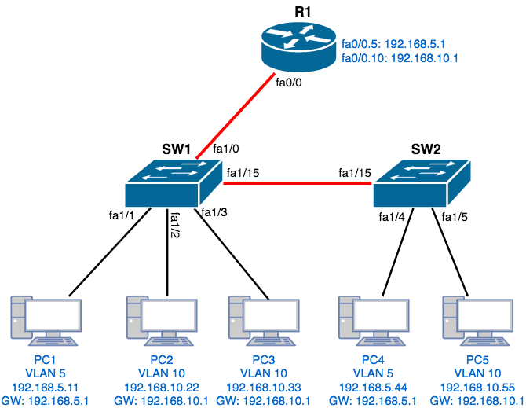
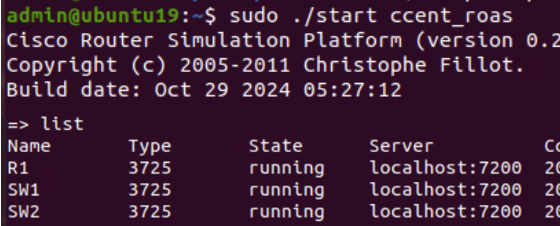
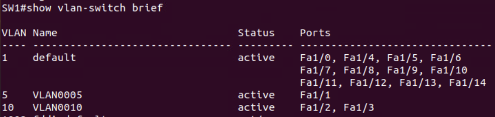
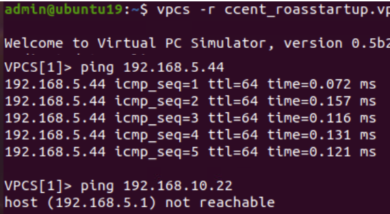
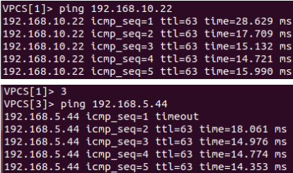
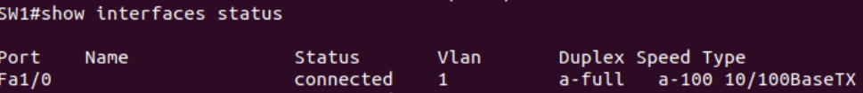
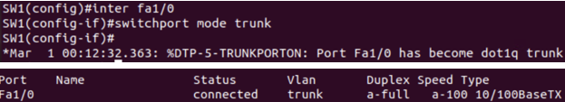
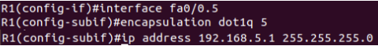

# Router-on-a-Stick VLAN Network Lab

## Practicing Cisco Networking with Linux

Many people assume that practicing Cisco networking requires expensive hardware or commercial simulation tools. However, it is possible to build a fully functional Cisco networking lab using **Linux-based tools**.

This project demonstrates how Cisco router and switch configurations can be practiced using the following open-source tools:

- **Dynamips** – emulates Cisco router hardware
- **Dynagen** – a text-based front-end used to control Dynamips
- **VPCS (Virtual PC Simulator)** – lightweight hosts used to simulate end devices
- **Linux** – provides the platform to run these tools efficiently

Using this setup, it is possible to create realistic network topologies and practice:

- VLAN configuration
- Switch port modes (access and trunk)
- Inter-VLAN routing
- Router subinterfaces
- Network troubleshooting

This approach allows students and engineers to build practical networking experience **without needing physical Cisco equipment**.

## Introduction

In their default state, all ports on a switch are in the same broadcast domain. VLANs (Virtual Local Area Networks) enable the segmentation of switch ports into smaller broadcast domains, creating logical network areas.

Devices within the same VLAN can communicate normally. However, devices in different VLANs cannot communicate directly without routing.

To enable communication between VLANs, **Inter-VLAN routing** must be configured. One common method is **Router-on-a-Stick**, where a router uses subinterfaces on a single trunk link connected to a switch to route traffic between VLANs.

---

## Network Topology



---

## Step 1 – Initialize Router Simulator

The router platform is started using **Dynagen / Dynamips**, bringing the router and switches into a running state.



---

## Step 2 – Verify Current VLANs

Before configuration, check the existing VLANs on the switch.

```
show vlan brief
```



---

## Step 3 – Launch Virtual PC Simulator

Host devices are simulated using **VPCS**.



---

## Step 4 – Initial Connectivity Test

Testing connectivity shows that devices in different VLANs cannot communicate.

Example:

• PC1 → PC4  
• PC1 → PC2  



---

## Step 5 – Configure Access Ports

Switch ports connected to hosts are configured as access ports assigned to their respective VLANs.



---

## Step 6 – Configure Trunk Link

The link between switches must allow multiple VLANs using trunking.



---

## Step 7 – Configure Router Subinterfaces

Router-on-a-stick is implemented using router subinterfaces.

Example:

```
interface fa0/0.5
encapsulation dot1Q 5
ip address 192.168.5.1 255.255.255.0
```



---

## Step 8 – Verify Inter-VLAN Communication

After configuring router subinterfaces, devices across VLANs can now communicate.

Connectivity tests confirm successful routing between VLANs.


---

## Technologies Used

- Cisco IOS
- VLAN Configuration
- 802.1Q Trunking
- Router-on-a-Stick
- Dynagen
- Dynamips
- VPCS
